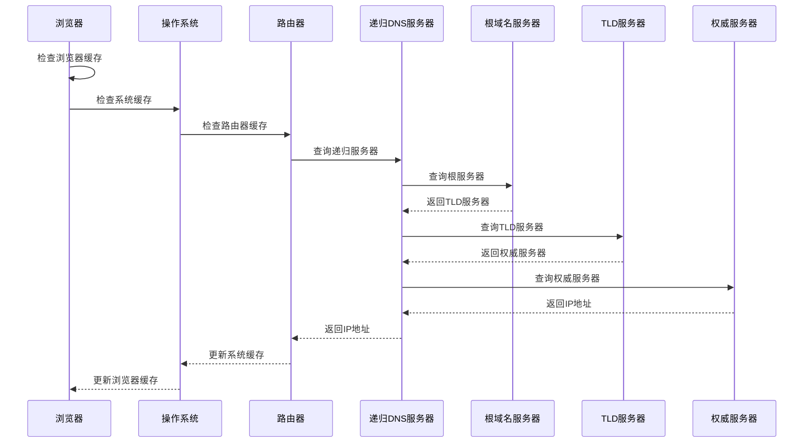
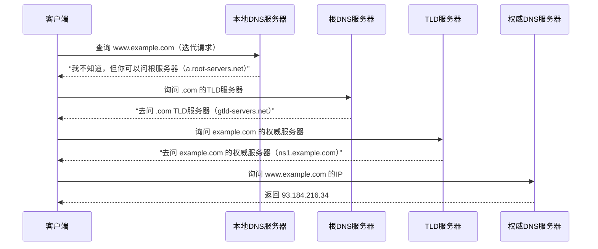
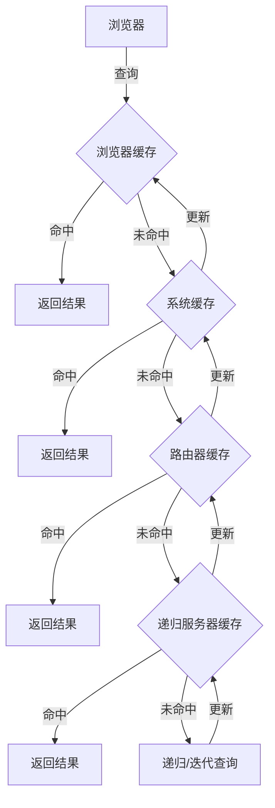

# DNS（域名系统）终极详解

## 1. DNS基础概念

### 1.1 什么是DNS
- **定义**：域名系统（Domain Name System），将域名转换为IP地址的分布式数据库系统
- **作用**：实现域名与IP地址的双向解析
- **特点**：
  - 分布式架构
  - 层次化域名空间
  - 采用C/S模式
  - 使用UDP/TCP协议（端口53）

### 1.2 域名结构
- **层次结构**：从右到左，由高到低
  - 根域名（.）
  - 顶级域名（TLD，top level domain）：.com、.org、.net、.cn等
  - 二级域名：baidu、google等
  - 三级域名：www、mail、blog等
- **示例**：www.baidu.com.
  - 根域名：.（通常省略）
  - 顶级域名：.com
  - 二级域名：baidu
  - 三级域名：www

## 2. DNS解析过程

### 2.1 完整解析流程（以访问www.example.com为例）

#### 本地查询阶段（耗时0~5ms）
1. **浏览器缓存查询**
   - 检查浏览器DNS缓存
   - 缓存时间由TTL决定
   - 命中则直接返回IP地址

2. **操作系统缓存查询**
   - 检查操作系统DNS缓存
   - Windows：`ipconfig /displaydns`查看
   - Linux：`systemd-resolve --statistics`查看
   - 命中则直接返回IP地址

3. **hosts文件查询**
   - 检查本地hosts文件
   - Windows：`C:\Windows\System32\drivers\etc\hosts`
   - Linux：`/etc/hosts`
   - 命中则直接返回IP地址

4. **本地DNS服务器查询**
   - 检查路由器DNS缓存
   - 检查ISP DNS服务器缓存
   - 命中则直接返回IP地址

#### 递归查询阶段（典型耗时50~300ms）
1. **根域名服务器查询**
   - 递归服务器向根服务器查询
   - 获取.com的TLD服务器地址
   - 例如：a.gtld-servers.net
   - 典型响应时间：20-50ms

2. **TLD服务器查询**
   - 递归服务器向TLD服务器查询
   - 获取example.com的权威服务器地址
   - 例如：ns1.cloudflare.com
   - 典型响应时间：30-80ms

3. **权威服务器查询**
   - 递归服务器向权威服务器查询
   - 获取www.example.com的A记录
   - 例如：93.184.216.34
   - 典型响应时间：20-100ms

#### 响应返回阶段
1. **递归服务器处理**
   - 验证返回的IP地址
   - 检查DNS记录的有效性
   - 更新本地缓存

2. **客户端接收**
   - 递归服务器返回IP地址给客户端
   - 客户端更新本地缓存
   - 缓存时间由TTL决定

3. **建立连接**
   - 客户端使用获取的IP地址
   - 建立TCP连接
   - 开始HTTP请求

### 2.2 查询方式

| 对比项     | 递归查询                           | 迭代查询                                   |
|------------|------------------------------------|--------------------------------------------|
| 责任主体   | DNS 服务器必须返回最终答案         | DNS 服务器可返回“线索”（其他服务器地址）  |
| 查询压力   | 由递归服务器承担全部查询工作       | 由客户端（或初始服务器）逐步查询           |
| 典型场景   | 客户端向本地 DNS 服务器发起请求    | DNS 服务器之间的层级查询                   |
| 响应内容   | 直接返回 IP 地址或错误             | 可能返回下一级服务器的地址                 |

### 2.3 DNS解析流程图
#### (1) 递归查询

**适用场景**
客户端（如电脑、手机）向本地DNS服务器（如ISP的114.114.114.114或公共DNS8.8.8.8）发起请求。

本地DNS服务器必须返回最终结果（IP地址或“域名不存在”）

#### (2) 迭代查询
**适用场景**
DNS服务器之间的查询（如本地DNS服务器向根服务器、TLD服务器查询）。

客户端直接向各级DNS服务器发起分步查询（罕见，通常由程序实现）。

#### 实际应用中的组合模式
**1. 混合查询（最常见）**
 - 客户端 → 递归DNS服务器：客户端发起递归查询（要求最终答案）。

 - 递归DNS服务器 → 其他DNS服务器：递归服务器代表客户端发起迭代查询，最终汇总结果返回客户端。

**2. 示例（用户访问网站）**
 - 用户在浏览器输入www.example.com，操作系统向本地DNS服务器（如8.8.8.8）发起递归查询。

 - 本地DNS服务器依次向根服务器、TLD服务器、权威服务器发起迭代查询。

 - 本地DNS服务器将最终IP通过递归响应返回给客户端。

### 2.4 DNS缓存机制

## 3. DNS记录类型

### 3.1 常见记录类型
| 记录类型 | 功能说明         | 典型应用场景               | 示例记录                                              |
|----------|------------------|----------------------------|-------------------------------------------------------|
| A        | IPv4 地址解析    | 网站主域名解析             | `@ A 192.0.2.1`                                       |
| AAAA     | IPv6 地址解析    | 支持 IPv6 的网站           | `www AAAA 2001:db8::1`                                |
| CNAME    | 域名别名指向     | CDN 加速、服务迁移         | `blog CNAME myblog.medium.com`                       |
| MX       | 邮件服务器指定   | 企业邮箱部署               | `@ MX 10 mail.example.com`                           |
| TXT      | 文本验证信息     | SPF 反垃圾 / SSL 证书验证  | `@ TXT "v=spf1 include:_spf.google.com ~all"`        |
| NS       | 指定权威 DNS 服务器 | 域名托管转移             | `@ NS ns1.dnspod.com`                                 |
| SRV      | 服务定位记录     | VoIP / 即时通讯服务        | `_sip._tcp SRV 10 60 5060 sipserver.example.com`      |

### 3.2 特殊记录
- **PTR记录**：反向解析（IP→域名）
- **SRV记录**：服务记录
- **CAA记录**：证书颁发机构授权

## 4. DNS服务器类型

### 4.1 按功能分类
- **根域名服务器**：全球13个根服务器集群
- **顶级域名服务器**：管理顶级域名
- **权威域名服务器**：管理具体域名
- **递归域名服务器**：提供DNS解析服务

### 4.2 按部署位置分类
- **公共DNS**：
  - Google DNS：8.8.8.8
  - Cloudflare：1.1.1.1
  - 阿里DNS：223.5.5.5
- **运营商DNS**：
  - 电信：114.114.114.114
  - 联通：119.29.29.29
  - 移动：211.136.192.6

## 5. DNS安全

### 5.1 常见攻击
- **DNS劫持**：修改DNS解析结果
- **DNS放大攻击**：利用DNS响应包进行DDoS
- **DNS隧道**：通过DNS协议传输其他协议数据
- **DNS缓存投毒**：污染DNS缓存

### 5.2 安全防护
- **DNSSEC**：DNS安全扩展
- **DNS over HTTPS/TLS**：加密DNS查询
- **DNS过滤**：阻止恶意域名
- **DNS监控**：检测异常查询
