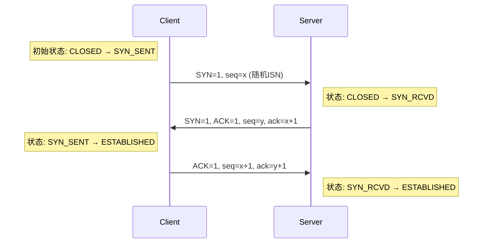
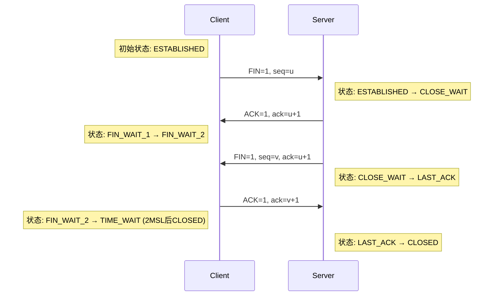

# TCP协议详解：特性、握手与挥手全流程

## 一、TCP协议核心特性

TCP（Transmission Control Protocol）是传输层的面向连接、可靠传输协议，其核心设计目标是为应用层提供无差错、不丢失、不重复且有序的数据流。以下是其核心特性：

| 特性       | 说明                                                                 |
|------------|--------------------------------------------------------------------|
| 面向连接   | 通信前需三次握手建立连接，结束后四次挥手释放连接。                 |
| 可靠传输   | 通过确认应答（ACK）、超时重传、序列号机制保障数据完整。             |
| 流量控制   | 滑动窗口机制动态调整发送速率，避免接收方缓冲区溢出。               |
| 拥塞控制   | 慢启动、拥塞避免算法（如TCP Reno）防止网络过载。                   |
| 全双工通信 | 双方可同时发送和接收数据。                                         |
| 字节流服务 | 数据被视为无结构的字节流，应用层需自行处理消息边界（如HTTP的Content-Length）。 |


## 二、TCP头部结构

TCP头部至少20字节（不含选项字段），关键字段如下：



**步骤解析：**

- **第一次握手（SYN）：**
  - 客户端发送SYN=1，携带随机初始序列号seq=x。
  - 进入SYN_SENT状态。
- **第二次握手（SYN+ACK）：**
  - 服务器回复SYN=1, ACK=1，携带自己的初始序列号seq=y，并确认客户端的ack=x+1。
  - 进入SYN_RCVD状态。
- **第三次握手（ACK）：**
  - 客户端确认服务器的ack=y+1，连接建立完成。
  - 双方进入ESTABLISHED状态。

### 3. 为什么需要三次握手？
- 防止历史重复连接：若旧的SYN包延迟到达，服务器会要求客户端确认（第三次握手），客户端可拒绝无效连接。
- 同步初始序列号：双方需确认对方的序列号（用于后续数据排序）。


## 四、TCP四次挥手（连接释放）

### 1. 挥手目的
- 双方确认数据已发送完毕。
- 安全关闭双向连接。

### 2. 详细流程



**步骤解析：**

- **第一次挥手（FIN）：**
  - 客户端发送FIN=1, seq=u，进入FIN_WAIT_1状态。
  - 表示客户端无数据发送，但可接收数据。
- **第二次挥手（ACK）：**
  - 服务器回复ACK=1, ack=u+1，进入CLOSE_WAIT状态。
  - 客户端收到后进入FIN_WAIT_2状态。
- **第三次挥手（FIN）：**
  - 服务器发送FIN=1, seq=v（数据发送完毕），进入LAST_ACK状态。
- **第四次挥手（ACK）：**
  - 客户端回复ACK=1, ack=v+1，进入TIME_WAIT状态（等待2MSL后关闭）。
  - 服务器收到后立即关闭连接。

### 3. 关键问题
- **为什么需要四次挥手？**
  - TCP是全双工的，需分别关闭两个方向的数据流：
    - 客户端→服务器方向（第一次挥手）。
    - 服务器→客户端方向（第三次挥手）。
- **TIME_WAIT状态的作用（等待2MSL，通常1~4分钟）：**
  - 确保最后一个ACK到达服务器（若丢失，服务器会重传FIN）。
  - 让网络中残留的旧数据包失效（避免影响新连接）。


## 五、TCP可靠性保障机制

| 机制           | 原理                                                         |
|----------------|--------------------------------------------------------------|
| 确认应答（ACK）| 接收方返回ACK=1, ack=n+1确认收到数据。                      |
| 超时重传       | 发送方未收到ACK时重发数据（RTO动态计算）。                  |
| 序列号         | 每个字节分配唯一序号，用于排序和去重。                      |
| 滑动窗口       | 接收方通过窗口字段通告剩余缓冲区大小，控制发送速率。        |
| 快速重传       | 收到3个重复ACK时立即重传（避免等待超时）。                  |


## 六、Wireshark抓包分析示例

### 三次握手：

```
# 客户端 → 服务器
[SYN] Seq=0 Win=64240 Len=0 MSS=1460
# 服务器 → 客户端
[SYN, ACK] Seq=0 Ack=1 Win=29200 Len=0 MSS=1460
# 客户端 → 服务器
[ACK] Seq=1 Ack=1 Win=64240 Len=0
```

### 四次挥手：

```
# 客户端 → 服务器
[FIN, ACK] Seq=1 Ack=1 Win=64240 Len=0
# 服务器 → 客户端
[ACK] Seq=1 Ack=2 Win=29200 Len=0
# 服务器 → 客户端
[FIN, ACK] Seq=1 Ack=2 Win=29200 Len=0
# 客户端 → 服务器
[ACK] Seq=2 Ack=2 Win=64240 Len=0
```


### 总结

- TCP是可靠传输的基石：通过握手/挥手管理连接，通过序列号/ACK保障数据完整。
- 握手三次：避免历史连接问题，同步初始序列号。
- 挥手四次：全双工特性需独立关闭两个方向的数据流。
- TIME_WAIT：不是BUG而是设计，确保连接优雅关闭。

---

## UDP协议：特性、结构与应用

### 一、UDP协议核心特性

UDP（User Datagram Protocol，用户数据报协议） 是传输层的无连接、轻量级协议，设计目标是低延迟和高效率，牺牲可靠性换取传输速度。

| 特性         | 说明                                         |
|--------------|----------------------------------------------|
| 无连接       | 无需握手/挥手，直接发送数据包。               |
| 不可靠传输   | 不保证数据到达、不保证顺序、无重传机制。     |
| 无流量控制   | 发送速率完全由应用层控制。                   |
| 面向报文     | 保留应用层传入的报文边界（不拆分不合并）。   |
| 支持广播/多播| 可同时向多个目标发送数据（如视频会议）。      |
| 头部开销小   | 固定8字节头部（TCP至少20字节）。             |


### 二、UDP头部结构

```
 0                   1                   2                   3   
 0 1 2 3 4 5 6 7 8 9 0 1 2 3 4 5 6 7 8 9 0 1 2 3 4 5 6 7 8 9 0 1 
+-+-+-+-+-+-+-+-+-+-+-+-+-+-+-+-+-+-+-+-+-+-+-+-+-+-+-+-+-+-+-+-+
|          Source Port          |       Destination Port        |  → 端口号（标识应用）
+-+-+-+-+-+-+-+-+-+-+-+-+-+-+-+-+-+-+-+-+-+-+-+-+-+-+-+-+-+-+-+-+
|            Length             |           Checksum            |  → 数据报长度/校验和
+-+-+-+-+-+-+-+-+-+-+-+-+-+-+-+-+-+-+-+-+-+-+-+-+-+-+-+-+-+-+-+-+
|                        Data (if any)                         |  → 应用层数据
+-+-+-+-+-+-+-+-+-+-+-+-+-+-+-+-+-+-+-+-+-+-+-+-+-+-+-+-+-+-+-+-+
```

**字段说明：**
- **源/目标端口**：16位，标识发送和接收的应用（如DNS=53）。
- **长度**：16位，指示整个UDP数据报的长度（最小8字节）。
- **校验和**：可选字段，用于简单错误检测（IPv6强制启用）。


### 三、UDP适用场景

| 场景             | 协议示例         | 选择UDP的原因                       |
|------------------|------------------|--------------------------------------|
| 实时音视频传输   | RTP/WebRTC       | 延迟敏感，少量丢包不影响体验         |
| 在线游戏         | QUIC（部分游戏） | 需要快速响应，TCP重传会导致卡顿      |
| DNS查询          | DNS              | 请求体积小，重试成本低               |
| 物联网传感器数据 | MQTT-SN          | 低功耗设备需减少协议开销             |
| 广播/多播应用    | DHCP、IPTV       | TCP不支持多播                        |


### 四、UDP的优缺点

#### 1. 优势
- **低延迟**：无需握手，直接传输（游戏/直播场景优势明显）。
- **低开销**：头部仅8字节，无连接状态维护。
- **灵活性**：应用层可自定义可靠性逻辑（如QUIC在UDP上实现可靠传输）。

#### 2. 劣势
- **不可靠**：需应用层处理丢包、乱序问题。
- **易受攻击**：无连接状态，易遭UDP洪水攻击（需防火墙防护）。
- **无拥塞控制**：可能加剧网络拥堵（需应用层实现限速）。


### 五、Wireshark抓包示例

**UDP DNS查询：**

```
Source Port: 54321    Destination Port: 53
Length: 32            Checksum: 0x2a1b
Data: DNS Query for www.example.com
```

**对比TCP HTTP请求：**

```
Source Port: 49152    Destination Port: 80
Sequence Number: 1     Acknowledgment Number: 1
Header Length: 20      Flags: [ACK, PSH]
Window Size: 64240     Checksum: 0x5983
Data: HTTP GET / HTTP/1.1
```

---

## UDP与TCP的全面对比

| 对比维度   | UDP                        | TCP                                 |
|------------|----------------------------|-------------------------------------|
| 连接方式   | 无连接                     | 面向连接（三次握手）                |
| 可靠性     | 不保证到达、不排序、不重传 | 确认应答、超时重传、有序交付        |
| 流量控制   | 无                         | 滑动窗口动态调整                    |
| 拥塞控制   | 无                         | 慢启动、拥塞避免等算法              |
| 头部开销   | 8字节（固定）              | 至少20字节（含选项字段）            |
| 传输效率   | 高（无控制机制）           | 较低（需维护连接状态）              |
| 数据边界   | 保留报文边界               | 字节流（无边界，需应用层处理）      |
| 多播/广播  | 支持                       | 不支持                              |
| 典型应用   | DNS、视频会议、游戏        | HTTP、FTP、电子邮件                 |

---

### 进阶技术：在UDP上实现可靠性

#### 1. QUIC协议（HTTP/3基础）
- Google开发：在UDP上实现多路复用、加密、重传等TCP特性。
- **优势：**
  - 减少握手延迟（0-RTT连接恢复）。
  - 避免TCP队头阻塞（独立流控制）。

#### 2. 自定义可靠UDP
- **实现方式：**
  - 添加序列号/ACK机制（如RTMP）。
  - 前向纠错（FEC）减少重传。 