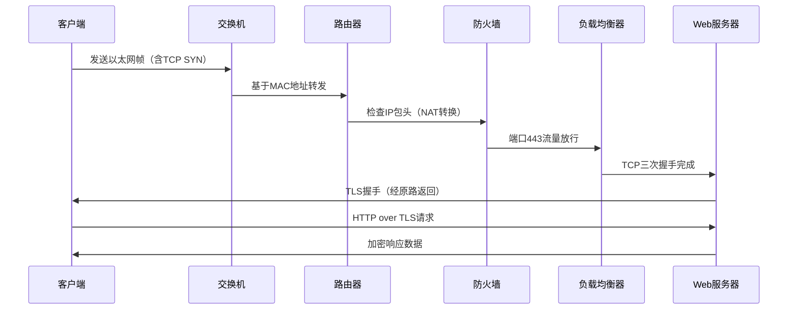
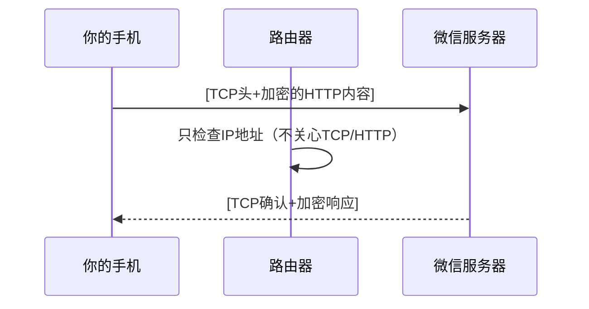

# 计算机网络协议与设备的关系

## 各层协议与设备对应表
| 层级         | 做什么事           | 常用协议                | 负责的设备     | 举个栗子🌰                         |
|--------------|--------------------|-------------------------|----------------|------------------------------------|
| 应用层       | 直接和人打交道     | HTTP, DNS, FTP          | 电脑/手机      | 浏览器输入网址访问百度             |
| 传输层       | 确保数据完整送到   | TCP, UDP                | -              | TCP像挂号信，UDP像普通明信片       |
| 网络层       | 找路和送快递       | IP, ICMP                | 路由器         | 路由器决定快递走哪条路最快         |
| 数据链路层   | 小区内送货         | Ethernet, WiFi          | 交换机         | 交换机根据门牌号（MAC）送快递      |
| 物理层       | 实际运输工具       | 网线, 光纤, 无线电波     | 网卡/集线器     | 网线就像送快递的卡车               |

## 关键设备的作用
 - **交换机（数据链路层）：**

    - 相当于小区快递站，记住每家每户的MAC地址（门牌号）

    - 只负责把数据包送到同一局域网内的设备

 - **路由器（网络层）：**

    - 相当于快递中转站，查看IP地址（具体地址）决定下一站往哪送

    - 连接不同网络（如把你家的网络和互联网连起来）

 - **电脑/手机：**

     - 处理所有层级：既运行应用（浏览器），也处理TCP/IP协议

#### 举个完整例子🌰
你发微信给朋友：

 - 微信APP（应用层）输入文字

 - 手机用TCP（传输层）打包，标记聊天服务器的端口

 - 加IP地址（网络层）并通过WiFi（数据链路层+物理层）发出

 - 你家路由器（网络层）把数据送到互联网

 - 朋友的手机反向解包，最终显示消息

 记住这个口诀：
**"应用想要传数据，TCP/IP来帮忙，交换机认MAC，路由器看IP，最终变成电信号！"**

---

## 典型数据处理流程（以HTTPS网页访问为例）

---
## 协议处理详细分解
**某些协议不需要网络设备（如路由器、交换机）的加工处理** ，它们主要在**通信两端的主机** 上发挥作用。这类协议通常分为两类：

 - **端到端协议（End-to-End Protocols）：** 仅在通信终端处理（如TCP、HTTP）。

 - **逐跳协议（Hop-by-Hop Protocols）：** 需要网络设备参与（如IP、ARP）。

### 1. 端到端协议（设备不参与）

**典型协议：**
- **TCP**：三次握手、数据重传、流量控制（仅你的电脑和服务器处理）
- **HTTP**：网页请求/响应内容（路由器看不懂网页内容）
- **TLS**：加密协商（只有两端需要解密）

**为什么设备不处理？**
- 路由器/交换机如果检查所有TCP/HTTP内容，会像快递员拆开每封信看内容，效率极低！
- **端到端原则**：让终端做复杂工作，网络设备专注"运输"。

**示例流程（发微信）：**

### 2. 逐跳协议（设备必须参与）

**典型协议：**
- **IP**：每个路由器都要查看IP地址决定下一跳
- **ARP**：交换机帮你把IP转换成MAC地址（像问路）
- **OSPF**：路由器之间互相告知"哪条路更近"

**设备如何参与？**

| 协议 | 处理设备 | 设备做了什么 |
|------|----------|--------------|
| IP   | 路由器   | 查看目标IP，查路由表决定从哪个端口转发 |
| ARP  | 交换机   | 广播询问"这个IP是谁的？"，记录MAC地址 |
| ICMP | 所有设备 | 返回ping结果或错误提示（如"网络不可达"） |

**示例流程（访问网站）：**

### 3. 设备与协议对应表

| 设备       | 处理的协议      | 不处理的协议    | 原因                       |
|------------|----------------|----------------|----------------------------|
| 家用路由器 | IP, ICMP, ARP  | TCP, HTTP, FTP | 只负责"送到"，不关心"送什么" |
| 交换机     | ARP, MAC地址   | IP, TCP        | 只看门牌号（MAC），不看地址（IP） |
| 你的电脑   | 所有端到端协议  | -              | 最终数据的发送方和接收方     |

### 为什么这样设计？

#### 效率优先
- 路由器每秒处理百万个数据包，如果每个都检查TCP内容会崩溃
- 就像快递分拣机只扫码不拆箱

#### 职责分离
- **终端**：处理复杂应用逻辑（如视频解码）
- **网络设备**：专注高效传输（像高速公路只管通车）

#### 灵活性
- 新增应用协议（如微信）无需升级路由器

### 生活化类比

**场景：网购一件衣服**

- **端到端协议** = 你和商家的沟通（讨论颜色/尺寸）
  - 快递员不参与
- **逐跳协议** = 快递运输过程
  - 每个中转站都要查看快递单号（IP地址）
  - 但不会打开包裹看聊天记录（HTTP内容）