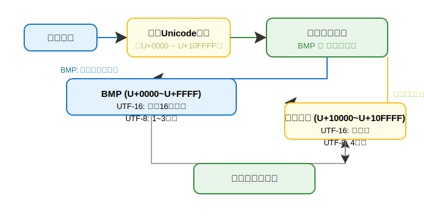

# 文字编码体系完全指南：从ASCII到Unicode与UTF-8

---

## 一、ASCII编码体系

### 1. 基本概念与发展历史
ASCII（美国信息交换标准代码）诞生于1963年，由美国国家标准协会（ANSI）制定，是计算机领域最早的字符编码标准之一。它最初基于电报码系统设计，用于在计算机和通信设备间交换信息。

### 2. 技术规格详解
- **7位编码体系**：使用7位二进制表示字符（2^7=128种可能）
- **存储实现**：每个字符实际占用1字节（8位），最高位恒为0
- **编码范围**：
  - 十六进制：0x00-0x7F
  - 十进制：0-127

### 3. 字符分类详表
| 类型       | 十六进制范围 | 十进制范围 | 包含内容   | 典型代表           |
|------------|--------------|------------|------------|--------------------|
| 控制字符   | 0x00-0x1F    | 0-31       | 设备控制符 | BEL(响铃)、LF(换行)、CR(回车) |
| 可打印字符 | 0x20-0x7E    | 32-126     | 文本符号   | 空格(0x20)、A(0x41)、a(0x61)、数字 |
| 删除字符   | 0x7F         | 127        | 删除操作   | DEL                |

### 4. 经典示例
```ascii
'A' → 65 → 0x41 → 01000001
'0' → 48 → 0x30 → 00110000
' ' → 32 → 0x20 → 00100000
```

### 5. 重要局限性
- **语言支持**：仅包含基础拉丁字母，无法表示非英语字符
- **符号缺失**：缺少数学符号、货币符号等特殊字符
- **扩展问题**：最高位被浪费，无法用于扩展字符集

---

## 二、Unicode编码体系

### 1. 设计理念与演进
Unicode创建于1991年，旨在解决ASCII的局限性，建立全球统一的字符编码标准。最新版本Unicode 15.1（2023年发布）包含149,813个字符。

### 2. 核心架构
- **码点系统**：
  - 表示法：U+[4-6位十六进制]（如U+0041）
  - 范围：U+0000至U+10FFFF（1,114,112个码位）
- **平面划分**：

| 平面编号 | 范围            | 内容               |
|----------|-----------------|--------------------|
| 0 (BMP)  | U+0000-U+FFFF   | 常用字符           |
| 1-16     | U+10000-U+10FFFF| 特殊字符、历史文字等 |

#### Unicode平面划分深度解读

Unicode将所有字符码点划分为17个"平面"（Plane），每个平面包含65,536（2^16）个码点。这样设计的原因是：

- **分层管理**：常用字符集中在第0平面（BMP），便于编码实现和兼容性处理。
- **扩展性强**：为历史文字、表情符号、特殊符号等预留了大量空间，避免未来冲突。
- **技术实现**：UTF-16编码中，BMP内的字符可用单个16位单元表示，超出BMP的字符需用代理对（Surrogate Pair）编码。

| 平面编号 | 范围            | 名称             | 主要内容举例                   |
|----------|-----------------|------------------|-------------------------------|
| 0        | U+0000-U+FFFF   | 基本多文种平面（BMP） | 常用中英文、日文、韩文、符号等 |
| 1        | U+10000-U+1FFFF | 辅助平面1（SMP）     | 表情符号、古文字、乐谱符号等   |
| 2        | U+20000-U+2FFFF | 辅助平面2（SIP）     | CJK扩展汉字                   |
| 3        | U+30000-U+3FFFF | 辅助平面3（TIP）     | 罕见汉字                      |
| 4~13     | U+40000-U+DFFFF | 预留              | 未来扩展                      |
| 14       | U+E0000-U+EFFFF | 辅助平面14（SSP）    | 语言标签                      |
| 15~16    | U+F0000-U+10FFFF| 私有区            | 用户自定义字符                |

- **BMP（基本多文种平面）**：绝大多数现代文字和符号都在此平面，兼容性最好。
- **SMP/SIP/TIP**：用于扩展字符、历史文字、表情等。
- **私有区**：供企业或个人自定义字符，不会被官方分配。

---

#### Unicode编码流程图



### 3. 编码实现方式对比
| 编码方案 | 字节数 | 特点           | 适用场景         |
|----------|--------|----------------|------------------|
| UTF-8    | 1-4    | 兼容ASCII，空间效率高 | 网络传输、存储   |
| UTF-16   | 2或4   | 固定长度为主   | 系统内部处理     |
| UTF-32   | 4      | 固定长度，空间浪费 | 特殊应用         |

### 4. 典型字符示例
```unicode
拉丁字母：U+0041 ('A')
中文字符：U+4E2D ('中')
表情符号：U+1F60A ('😊')
货币符号：U+20AC ('€')
```

---

## 三、UTF-8编码深度解析

### 1. 编码规则详表
| Unicode范围      | 字节数 | 二进制模板                           | 示例                                 |
|------------------|--------|--------------------------------------|--------------------------------------|
| U+0000-U+007F    | 1      | 0xxxxxxx                             | 'A' → 01000001                      |
| U+0080-U+07FF    | 2      | 110xxxxx 10xxxxxx                    | 'ñ' → 11000011 10110001             |
| U+0800-U+FFFF    | 3      | 1110xxxx 10xxxxxx 10xxxxxx           | '中' → 11100100 10111000 10101101   |
| U+10000-U+10FFFF | 4      | 11110xxx 10xxxxxx 10xxxxxx 10xxxxxx  | '😊' → 11110000 10011111 10011000 10001010 |

### 2. 编码/解码实战演示
**编码过程（以'中'为例）：**

- 查Unicode码点：U+4E2D → 0100 1110 0010 1101
- 确定编码方案：3字节格式（U+0800-U+FFFF）
- 位分配：

```
模板：1110xxxx 10xxxxxx 10xxxxxx
填充：1110[0100] 10[111000] 10[101101]
结果：11100100 10111000 10101101 → E4 B8 AD
```

**解码过程（收到E4 B8 AD）：**
- 识别首字节：E4→11100100→3字节序列
- 提取有效位：
  - 字节1：0100
  - 字节2：111000
  - 字节3：101101
- 组合码点：0100+111000+101101 = 0100111000101101 → U+4E2D

### 3. 特殊案例处理
- **ASCII兼容**：任何ASCII文本都是有效的UTF-8
- **非法序列**：如遇到C0 80（NULL的非最短形式）应拒绝
- **代理对**：U+D800-U+DFFF范围内的码点无效

---

## 四、编码转换与安全实践

### 1. 编程语言实现示例
```python
# Python编码转换
text = "中文€😊"
utf8_bytes = text.encode('utf-8')  # b'\xe4\xb8\xad\xe6\x96\x87\xe2\x82\xac\xf0\x9f\x98\x8a'
decoded_text = utf8_bytes.decode('utf-8')

# 验证UTF-8有效性
import re
def is_valid_utf8(data):
    try:
        data.decode('utf-8')
        return True
    except UnicodeDecodeError:
        return False
```

### 2. 安全开发准则
- **输入验证：**
  - 始终明确指定编码格式
  - 拒绝非最短形式的UTF-8序列
- **输出处理：**
  - 响应头声明编码（如HTTP的Content-Type: text/html; charset=utf-8）
  - 对动态内容进行HTML实体编码
- **存储规范：**
  - 数据库字段使用UTF-8MB4字符集
  - 文件保存时包含BOM（仅Windows系统需要）

### 3. 常见问题解决方案
| 问题现象   | 可能原因           | 解决方案                       |
|------------|--------------------|--------------------------------|
| 乱码显示   | 编码声明不一致     | 统一使用UTF-8                  |
| 字符截断   | 4字节字符处理不当  | 使用支持UTF-8MB4的数据库       |
| 验证绕过   | 编码混淆攻击       | 规范化输入后再验证             |

---

## 五、编码体系对比总结

| 特性       | ASCII      | Unicode      | UTF-8           |
|------------|------------|--------------|-----------------|
| 设计目标   | 英语通信   | 全球文字统一 | Unicode高效实现 |
| 字符容量   | 128        | 1,114,112    | 同Unicode       |
| 存储效率   | 1字节/字符 | 不直接存储   | 1-4字节/字符    |
| 兼容性     | 基础标准   | 包含ASCII    | 完全兼容ASCII   |
| 典型应用   | 传统系统   | 现代标准     | 网络/存储       |

---

通过这份完整的编码体系指南，您应该能够：

- 理解各编码标准的设计原理
- 掌握UTF-8的编码/解码机制
- 在实际开发中正确处理多语言文本
- 避免常见的编码相关安全问题 