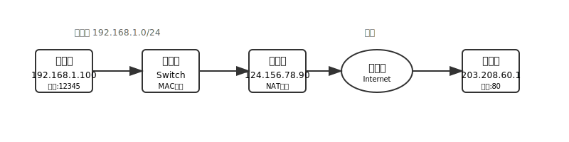
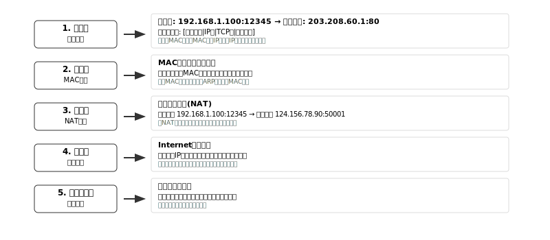
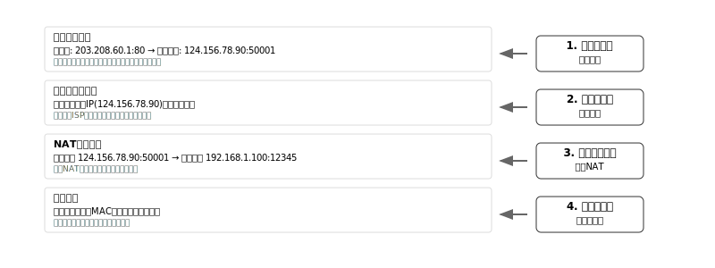
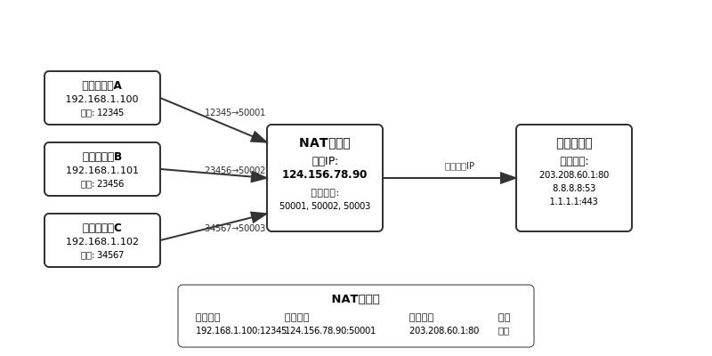

# 网络通信基本流程

## 1. 网络设备概述

### 1.1 主要设备功能
- **交换机（Switch）**：工作在数据链路层，根据MAC地址转发数据帧
- **路由器（Router）**：工作在网络层，根据IP地址进行路由转发，通常集成NAT功能
- **服务器（Server）**：提供网络服务的目标设备

### 1.2 基本网络拓扑

<!-- 网络通信拓扑图 -->

## 2. 出站通信流程（客户端→服务器）

### 2.1 流程步骤

1. **应用层数据封装**
   - 客户端应用程序生成数据
   - 添加传输层头部（TCP/UDP）
   - 添加网络层头部（IP）
   - 添加数据链路层头部（以太网）

2. **本地交换机处理**
   - 查询MAC地址表
   - 根据目标MAC地址转发到相应端口
   - 如果MAC地址未知，发送ARP广播

3. **路由器NAT转换**
   - 检查目标IP是否为外网地址
   - 进行源地址转换：内网IP → 公网IP
   - 记录端口映射关系到NAT表

4. **互联网路由**
   - 根据路由表选择最佳路径
   - 逐跳转发到目标网络
   - 经过多个ISP路由器

5. **到达目标服务器**
   - 目标网络路由器接收数据包
   - 转发给目标服务器
   - 服务器处理请求

### 2.2 出站流程图

## 3. 入站通信流程（服务器→客户端）

### 3.1 流程步骤

1. **服务器响应处理**
   - 服务器应用程序生成响应数据
   - 使用请求中的源地址作为目标地址
   - 目标地址为客户端的公网IP和端口

2. **服务器端网络转发**
   - 通过服务器端交换机
   - 经过服务器端路由器
   - 进入互联网

3. **互联网返回路由**
   - 根据目标公网IP进行路由
   - 数据包返回到客户端网络的路由器

4. **客户端路由器反向NAT**
   - 查询NAT映射表
   - 将公网地址转换回内网地址
   - 转发给内网交换机

5. **到达客户端**
   - 交换机根据MAC地址转发
   - 数据包到达客户端设备

### 3.2 入站流程图

## 4. 端口和端口映射

### 4.1 端口概念

**端口（Port）** 是传输层协议用来标识不同应用程序或服务的逻辑地址。

- **端口号范围**：0-65535
- **知名端口**：0-1023（系统保留）
- **注册端口**：1024-49151（应用程序使用）
- **动态端口**：49152-65535（临时分配）

### 4.2 常见端口号

| 服务 | 端口号 | 协议 | 说明 |
|------|--------|------|------|
| HTTP | 80 | TCP | 网页服务 |
| HTTPS | 443 | TCP | 安全网页服务 |
| FTP | 21 | TCP | 文件传输 |
| SSH | 22 | TCP | 安全远程登录 |
| DNS | 53 | UDP/TCP | 域名解析 |
| SMTP | 25 | TCP | 邮件发送 |

### 4.3 端口映射原理图

### 4.4 端口映射工作原理

1. **出站映射**
   - 内网设备发起连接时，路由器为每个连接分配一个唯一的公网端口
   - 在NAT表中记录：内网IP:端口 ↔ 公网IP:端口 ↔ 目标IP:端口

2. **入站映射**
   - 外部响应数据到达时，路由器查询NAT表
   - 根据公网端口找到对应的内网地址
   - 将数据转发给正确的内网设备

3. **连接追踪**
   - 路由器维护每个连接的状态信息
   - 连接结束后，释放映射的端口号
   - 端口号可以被重新分配给新的连接

## 关键知识点总结

### 1. 设备作用
- **交换机**：二层设备，MAC地址转发，连接同网段设备
- **路由器**：三层设备，IP地址路由，连接不同网络
- **NAT功能**：地址转换，使内网设备能访问外网

### 2. 通信要点
- **出站**：内网→交换机→路由器NAT→互联网→目标服务器
- **入站**：服务器→互联网→路由器反向NAT→交换机→内网设备
- **端口映射**：一个公网IP的不同端口对应不同内网设备

### 3.  重要概念
- **MAC地址**：数据链路层地址，用于同网段转发
- **IP地址**：网络层地址，用于跨网段路由
- **端口号**：传输层地址，用于区分不同应用服务
- **NAT表**：记录地址映射关系，确保数据正确返回